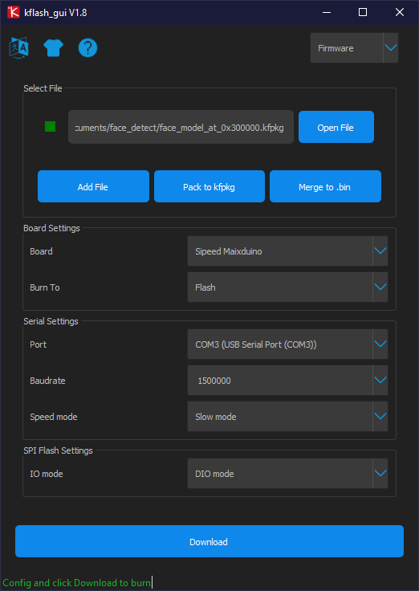

# face-detection-maixduino

## Ambiente de desenvolvimento
O maixduino oferece uma IDE própia para o desenvolvimento com suas placas, mas é possivel usar a IDE do arduino.
> [repositório para download da IDE](https://dl.sipeed.com/MAIX/MaixPy/ide/)

O uso da IDE é muito simples e descrito de forma bem explicada neste link: [documentação](https://wiki.sipeed.com/soft/maixpy/en/get_started/env_maixpyide.html)

A versão da IDE usada neste codigo foi a v0.2.5
## Drivers (necessário apenas para windows)
[Repositório para download do driver](https://dl.sipeed.com/MAIX/tools/driver)

[Modo de instalação](https://wiki.sipeed.com/soft/maixpy/en/get_started/install_driver/duino.html)

## Inserindo o modelo na placa
para inserir um modelo na placa foi utilizado um arquivo kfpkg que é um *.kmodel junto com um json no formato: 
```
  "version": "0.1.0",
  "files": [
    {
      "address": 0x300000,
      "bin": "m.kmodel",
      "sha256Prefix": false
    }
  ]
}
```
que serve pra indicar em que endereço de memória será armazenado o modelo. 

Mais informações sobre como funciona o armazenamento e memória da placa esta disponivel nesse [link](https://wiki.sipeed.com/soft/maixpy/en/get_started/get_started_fs.html)

Para inserir esse modelo na placa foi utilizado [kflash_gui](https://github.com/sipeed/kflash_gui/releases) com as seguintes configurações:


## Informações extras
A placa tem um sistema de execução de arquivos ao dar boot. Se dentro da memória da placa existir algum arquivo com o nome *boot.py* ele será executado assim que a placa der boot, logo em seguida (se existir) será executado um arquivo de nome *main.py*

O arquivo *boot.py* normalmente é utilizado pra configurar a placa antes de rodar o script 

O arquivo *main.py* normalmente é usado pra rodar o script que faz uso do modelo que esta na memória da placa (no caso desse script o modelo encontra-se no endereço 0x300000)


